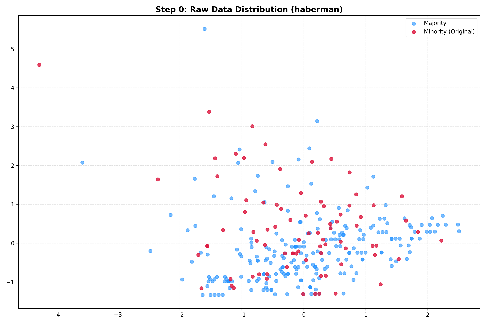
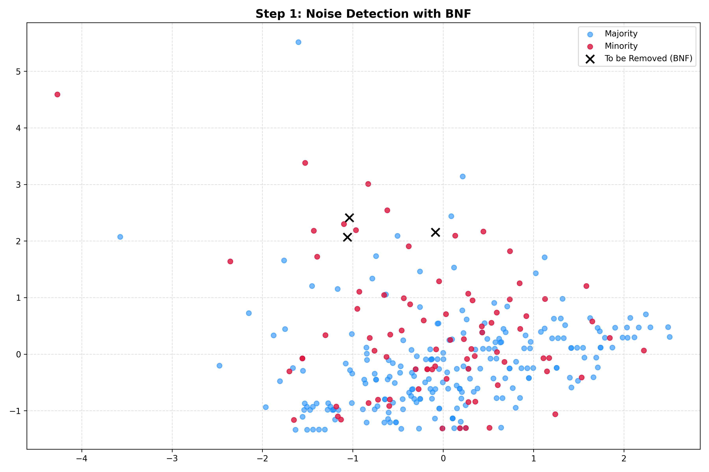
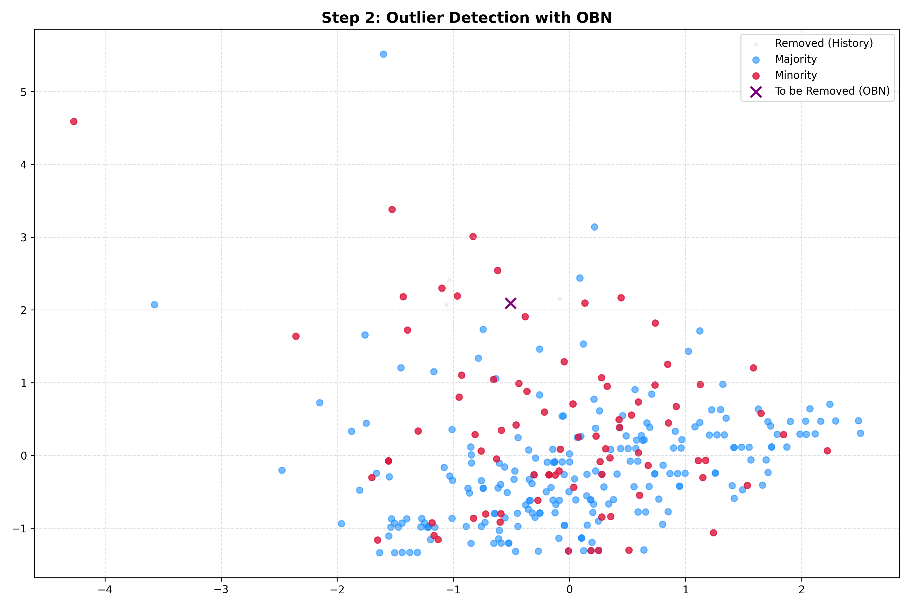
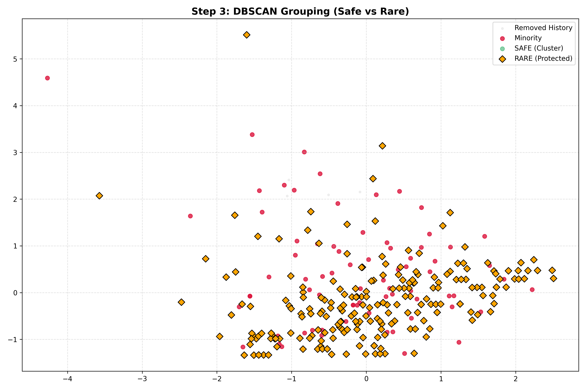
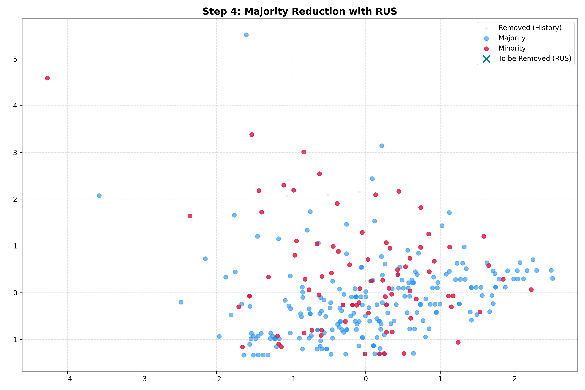
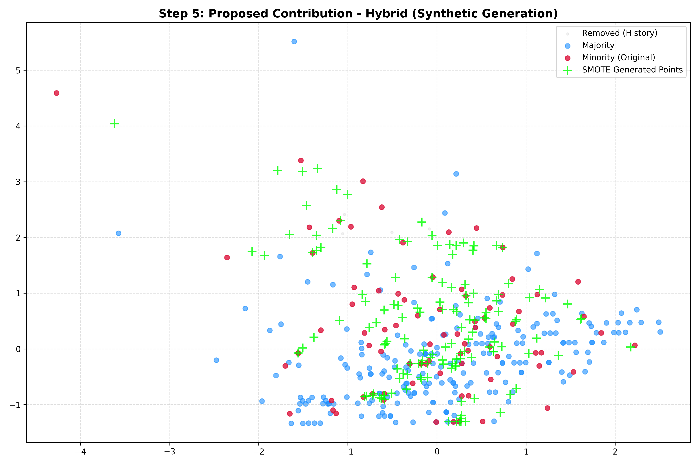
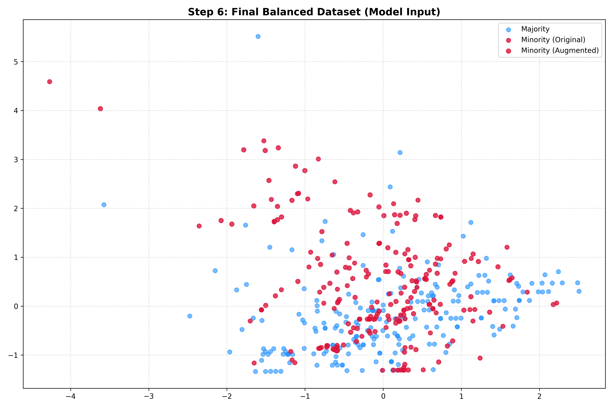

# A Hybrid Over-Sampling and Under-Sampling Approach Based on DBSCAN and SMOTE for Imbalanced Classification Problems

A comprehensive Python implementation of a "Clean-then-Generate" strategy that integrates the Synthetic Minority Over-sampling Technique (SMOTE) into a density-based cleaning pipeline for handling imbalanced datasets.

## Research Objective

Class imbalance is a significant challenge in machine learning, as it leads to models that are biased toward the majority class. While traditional methods like the BOD (Borderline Outlier Detection) approach by Peng & Park are effective at noise removal, they often lead to excessive data loss, leaving the minority class underrepresented. 

This study proposes a hybrid framework that:
- **First cleans** the majority class using DBSCAN to sanitize the data
- **Then generates** synthetic minority samples using SMOTE in the cleaned, safe regions
- **Prevents noise amplification** by ensuring SMOTE only operates on sanitized data

By using DBSCAN to sanitize the data before applying SMOTE, we prevent the common issue of noise amplification that occurs when SMOTE is applied to "dirty" data. This synergy allows us to preserve the noise-immunity of the BOD method while solving the data sparsity problem.

## Real-World Applications

The practical necessity of this work is evident in critical domains:

- **Medical Diagnosis**: Missing a rare disease because of a lack of samples can have fatal consequences. Our method ensures rare cases are amplified and recognized.
- **Financial Fraud Detection**: Fraudulent transactions are extremely rare. Our hybrid approach reinforces these subtle patterns, preventing them from being deleted during the cleaning process.

## Overview

This project implements a multi-stage "Clean-then-Generate" pipeline for preprocessing imbalanced datasets:

1. **BNF (Borderline Noise Filtering)** - Removes noisy borderline samples from the majority class
2. **OBN (Outlier Based on Noise)** - Detects and removes outliers from the majority class
3. **DBSCAN Clustering** - Separates safe (clustered) from rare (noise) majority samples and identifies rare minority instances
4. **RUS (Random Under Sampling)** - Reduces safe majority samples to match minority count
5. **SMOTE (Synthetic Minority Oversampling)** - Generates synthetic minority samples around protected rare and borderline points

## Requirements

### Python Version
- Python 3.7 or higher

### Dependencies

Install the required packages using pip:

```bash
pip install numpy scikit-learn imbalanced-learn matplotlib
```

Or create a `requirements.txt` file with:

```
numpy>=1.19.0
scikit-learn>=0.24.0
imbalanced-learn>=0.8.0
matplotlib>=3.3.0
```

Then install:

```bash
pip install -r requirements.txt
```

## Installation

1. Clone or download this repository
2. Install the required dependencies (see Requirements section above)
3. Ensure your datasets are in the `datasets/` folder in KEEL format (`.dat` files)

## Project Structure

```
gardprject/
├── BNF.py                    # Borderline Noise Filtering implementation
├── OBN.py                    # Outlier Based on Noise detection
├── DBSCAN.py                 # DBSCAN clustering for safe/rare separation
├── RUS.py                    # Random Under Sampling
├── SMOTE.py                  # Custom SMOTE wrapper with safety checks
├── keel_utils.py             # Utilities for loading KEEL format datasets
├── compare_methods.py        # Main script for comparing baseline, reference, and proposed methods
├── stepwise_visualizer.py    # Script for generating step-by-step visualizations
├── datasets/                 # Directory containing dataset files (.dat format)
└── README.md                 # This file
```

## Usage

### Running the Comparison Analysis

To compare the baseline, reference (Peng & Park method), and proposed (hybrid) methods:

```bash
python compare_methods.py
```

This will:
- Process all datasets in the `datasets/` folder
- Perform 5-fold stratified cross-validation
- Compare three methods:
  - **Baseline**: Raw imbalanced data
  - **Reference**: BNF + DBSCAN + RUS (under-sampling only)
  - **Proposed**: BNF + DBSCAN + RUS + SMOTE (hybrid approach)
- Generate results in `all_results_summary.txt`

### Generating Step-by-Step Visualizations

To visualize each preprocessing step for a specific dataset:

```bash
python stepwise_visualizer.py --dataset <dataset_name>
```

Example:
```bash
python stepwise_visualizer.py --dataset ecoli1
```

Optional parameters:
- `--datadir`: Directory containing datasets (default: `./datasets`)
- `--obn_k`: Number of neighbors for OBN (default: 5)
- `--obn_multiplier`: Multiplier for OBN threshold (default: 1.8)
- `--dbscan_eps`: Epsilon parameter for DBSCAN (default: 0.5)
- `--dbscan_min_samples`: Minimum samples for DBSCAN (default: 5)

This will generate visualization plots in the `plots_<dataset_name>/` directory showing:
- Step 0: Raw data distribution
- Step 1: BNF noise detection
- Step 2: OBN outlier detection
- Step 3: DBSCAN grouping (safe vs rare)
- Step 4: RUS under-sampling
- Step 5: SMOTE synthetic generation
- Step 6: Final balanced dataset

### Example: Step-by-Step Pipeline Visualization (Haberman Dataset)

The following visualization demonstrates the step-by-step transformation of the Haberman dataset through our hybrid pipeline. Notably, in Step 3, a significant portion of the minority class instances are categorized as 'rare' by the DBSCAN module. This reflects the intrinsic sparsity and high degree of class overlap within the Haberman dataset. Our proposed method utilizes these 'rare' samples as foundational seeds for SMOTE-based synthesis, leading to a 35% F1-score improvement.

| Step 0: Raw Data | Step 1: BNF Filtering | Step 2: OBN Detection |
|:---:|:---:|:---:|
|  |  |  |

| Step 3: DBSCAN Grouping | Step 4: RUS Under-sampling | Step 5: SMOTE Generation |
|:---:|:---:|:---:|
|  |  |  |

| Step 6: Final Balanced Dataset |
|:---:|
|  |

## Methodology

The proposed methodology follows a sequential "Clean-then-Generate" logic:

### 1. Noise Filtering (BNF & OBN)
**Purpose**: Preliminary cleaning to identify and remove majority-class noise and outliers that could mislead the classifier.

- **BNF (Borderline Noise Filtering)**: Identifies majority class samples that are close to minority class regions (borderline examples). Iteratively removes borderline samples if removal improves AUC score using Gaussian Naive Bayes classifier.
- **OBN (Outlier Based on Noise)**: Computes outlier scores based on mean distance to k-nearest neighbors. Removes majority class samples with scores above threshold (mean + multiplier × std).

### 2. Density-Based Categorization (DBSCAN)
**Purpose**: Critical stage for identifying "rare" minority samples that require protection from aggressive pruning.

- Separates remaining instances into clusters (Safe, Borderline, Rare, Outlier)
- **Safe**: Clustered majority samples (can be safely removed)
- **Rare**: Noise samples (protected from removal) - these are vital anchors for synthetic generation
- This stage is crucial because in high-overlap scenarios, many minority instances are categorized as 'rare', which our method treats as foundational seeds for SMOTE-based synthesis

### 3. Majority Pruning (RUS)
**Purpose**: Reduces class cardinality to the target ratio without losing critical boundary information.

- Random Under-Sampling (RUS) is applied specifically to majority class instances located in "safe" regions
- Reduces safe majority samples to match minority class count
- Ensures balanced dataset for training

### 4. Synthetic Augmentation (SMOTE)
**Purpose**: Strengthens decision boundaries in overlapping regions by generating synthetic instances around protected rare and borderline minority points.

- Generates synthetic minority samples using k-nearest neighbors
- Operates only on "sanitized" data (after DBSCAN cleaning), preventing noise amplification
- Uses rare minority instances as anchors for synthesis, transforming sparse signals into well-defined decision regions
- Includes safety checks for small datasets

### Key Innovation

The original BOD method by Peng & Park focuses strictly on under-sampling, arguing that over-sampling methods like SMOTE tend to replicate noise. However, we demonstrate that this problem only occurs when SMOTE is applied to "dirty" data. By using DBSCAN as a prior filter, we ensure that SMOTE only generates information in "safe" regions, creating a synergy that preserves noise-immunity while solving data sparsity.

## Experimental Results

The performance of the proposed Hybrid-SMOTE approach was evaluated across six benchmark datasets with varying Imbalance Ratios (IR). The comparison includes:

- **Baseline**: Raw imbalanced data (SVM classifier)
- **Reference (RUS)**: BNF + DBSCAN + RUS (under-sampling only) - Peng & Park method
- **Proposed (Hybrid)**: BNF + DBSCAN + RUS + SMOTE (hybrid approach)

### Key Findings

1. **Impact on Overlapping Classes**: The most significant breakthrough was observed in the Haberman dataset (IR: 2.78, high feature overlap). The reference BOD method slightly decreased the F1-score compared to the baseline, suggesting that pure under-sampling leads to critical information loss. However, our Hybrid-SMOTE approach achieved a **35.3% improvement in F1-score** by populating the "rare" regions identified by DBSCAN with synthetic minority samples.

2. **Resilience Against Noise**: In datasets like Glass1 and Yeast1, the Hybrid method consistently outperformed the reference BOD method in terms of both AUC and F1-score. This confirms that cleaning majority-class noise creates a "sanitized space" where SMOTE can generate high-quality data points without the risk of noise amplification.

3. **Sensitivity in Well-Separated Domains**: In datasets like Segment0 and Ecoli1, where the baseline AUC is already extremely high (>0.99), we observed a marginal decrease of approximately 0.2%. This indicates that in linearly separable or "easy" classification tasks, the introduction of synthetic minority points can lead to slight over-generalization. Therefore, our method is highly specialized for complex, "messy" data distributions where simple boundaries fail to form.

### Performance Summary

The comparison script generates a summary report (`all_results_summary.txt`) containing:
- AUC scores and F1-scores for each method across all datasets
- Performance gains compared to baseline
- Analysis of hybrid method improvements over reference method

## Technical Notes

- All random operations use fixed seeds (random_state=42) for reproducibility
- The code uses stratified cross-validation to ensure both classes are present in test sets
- The pipeline includes safety checks to handle edge cases (e.g., very small datasets)
- Minority class samples are intentionally kept intact during cleaning to preserve critical information
- The method is context-dependent: most effective in high-overlap, complex classification scenarios

## Citation

If you use this code in your research, please cite:

```
A hybrid over-sampling and under-sampling approach based on DBSCAN and SMOTE 
for imbalanced classification problems. Turk J Elec Eng & Comp Sci (2026).
```

## License

This project is provided as-is for research and educational purposes.